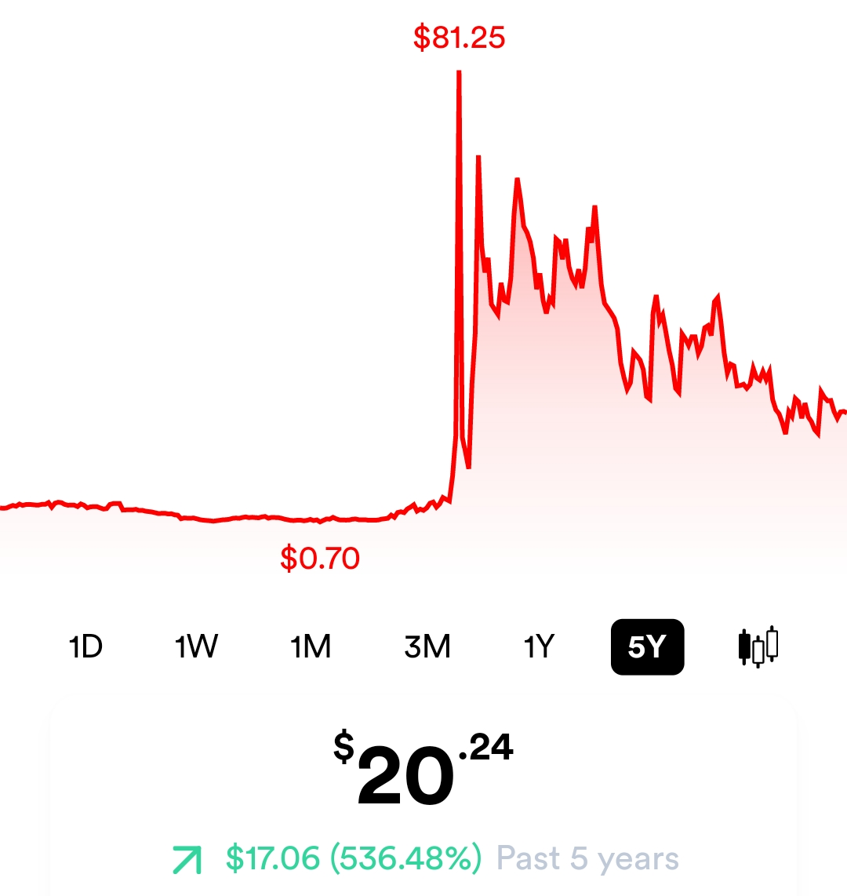
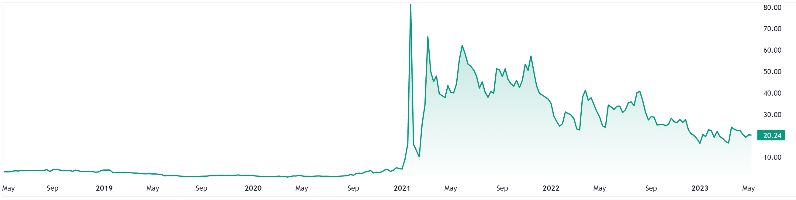
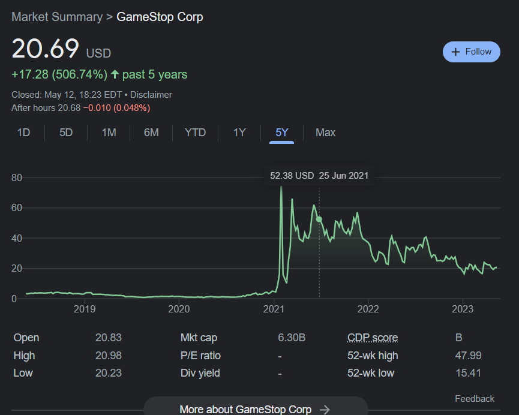

# Know Your Worth
<br>
<br>

This challenge is unique in my opinion, We were given 2 picture that show a graph of one US Stocks.

<p align=center>
    
    
<p>

We can see here that the stock reach it peak at 2021 with the value of $81.25, So I just search in google with this keyword `"US Stock $0.70 to $81.25 in 2021"`, but I find something quite funny I guess, I find a meme at reddit about `GAMESTOP` and that's where something *click in my Brain, so I just search the graph for Gamestop and I was right!

<p align=center>
    
</p>

So now I just need to find what I need, the flag format is `FindITCTF{stockname_TICKER_headquarters}`, I found the TICKER for GAMESTOP Stock is `GEM` and the HQ in `grapevine` so the last part is to assemble the flag and we're done!

```
FindITCTF{gamestop_GME_grapevine}
```