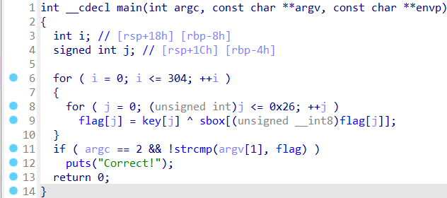

# Tracer
## Overview
Points: 267  
Category: Reverse Engineering

## Description
My friend said this program is "untraceable". I'm not quite sure what he meant.

[tracer](./tracer)

Developed by [Rajat Patel](https://github.com/PAndaContron)


## Hints

1. Is there a way to trace calls to standard library functions?

## Solution

First thing first, I like to decompile the binary so I can understand its flow, in this case I'm using IDA PRO to see the source code.

<p align=center>
    
</p>

We can see that when we run the binary, it require a string, so instead of just running like `./tracer`, we need to provide an args, so it will look like this `./tracer thisisaninput`, but everytime we run it like that nothing get printed out, so what's the solution here? We can use tools like `strace` or `ltrace`, I'll use ltrace in this case so I can see what happened if I put a string like that.

```
└─$ ltrace ./tracer input                                

strcmp("input", "jctf{1m_n3V3r_u51nG_l1bC_@gA1n_7"...) = -1
+++ exited (status 0) +++
```

It compares our input to the flag, but the flag is not complete yet, so how do we make it print everything and not just half of the flag? ltrace has a flag "-s" that we can use to print more character, let's use `-s 100` to print 100 character

```
└─$ ltrace -s 100 ./tracer input
strcmp("input", "jctf{1m_n3V3r_u51nG_l1bC_@gA1n_76a9f9e}") = -1
+++ exited (status 0) +++

```

By adding more char to print, we got the flag.

## Flag

```jctf{1m_n3V3r_u51nG_l1bC_@gA1n_76a9f9e```