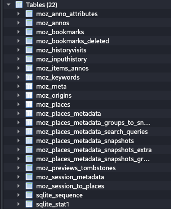
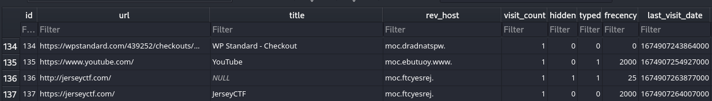

# firefox-history
## Overview
Points: 50  
Category: Forensics

## Description
On what date and time was the jerseyctf.com website LAST accessed? Use GMT time. Flag format is jctf{YYYY-MM-DD-HH-MM-SS}.

[places.sqlite](./places.sqlite)

Developed by [Rob](https://github.com/njccicrob)

## Hints

1. Use sqlite3 or another sqlite browser

## Solution

So we have a `places.sqlite` which contain a browser history in a firefox browser, we need to find the LAST time the user accessed the jerseyctf.com website, also we got a hints that we can finish this challenge using sqlite3 or another sqlite browser, luckly in Kali Linux we have a tool called `DB browser for SQLite`, now we open the sqlite and let's look around.

<p align=center>
    
</p>

We can see that above is all tables available, after some searching on google, I found out that `moz_historyvisit` has the log with an `epoch time` of the website you visited, and `moz_places` has the browser index-names
so first we need to find the index that has `jerseyctf.com`.

<p align=center>
     
</p>

We got the index and also the epoch time for the Last Accessed, the last thing we need to do is to translate the epoch to GMT time since we need Hour,Minute,Second and date to finish the flag. We can use https://www.epochconverter.com/ to translate epochtime to GMT time.

```
Assuming that this timestamp is in microseconds (1/1,000,000 second):

GMT           : Saturday, January 28, 2023 12:01:04.007 PM
Your time zone: Saturday, January 28, 2023 7:01:04.007 PM GMT+07:00
Relative: 3 months ago
```
We got the GMT time, now let's put it together!

## Flag

```jctf{2023-01-28-12-01-04}```