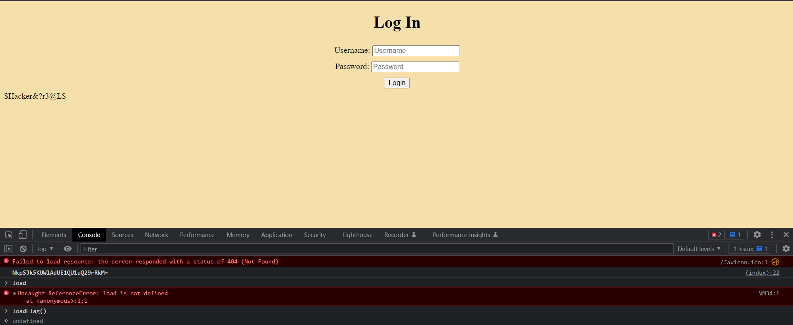

# look-im-hacking
## Overview
Points: 50  
Category: Web Exploitation

## Description
A jump back into time to something that looks old! However, despite the looks, its not as old as it seems...

Developed by [Ethan Ho](https://github.com/WokFriedE)

https://www.jerseyctf.online/

## Hints

1. Give it a closer look, maybe investigate a few things around.

## Solution

We got a website link that has a simple login with username and password there, but nothing more. I decided to see the source code and see what I can do there, so... yes I found this code snippet.

```javascript
    <script type="text/javascript">
        var passkey = '';

        function createPass() {
            const valids = "ABCDEFGHIJKLMNOPQRSTUVWXYZabcdefghijklmnopqrstuvwxyz0123456789$#@!&%"
            for (let i = 0; i < 20; i++) {
                passkey += valids.charAt(Math.floor(Math.random() * valids.length))
            }
            passkey = btoa(passkey);
        }

        function checkPass() {
            console.log(passkey)
            if (document.getElementById("un1").value == "admin" && document.getElementById("pw2").value == atob(passkey)) {
                loadFlag();
            }
        }

        function loadFlag() {
            const xhttp = new XMLHttpRequest();
            xhttp.onload = function () {
                document.getElementById("reveal").innerHTML = this.responseText;
            }
            xhttp.open("GET", "./flag.txt")
            xhttp.send();
        }
    </script>
```

Seing the code above we can just call the `loadFlag()` function in the console, so I tried that and found the flag.

<p align=center>
    
</p>

We just need to wrap the flag with the format `jctf{.*}`

## Flag

```jctf{$Hacker&?r3@L$}```