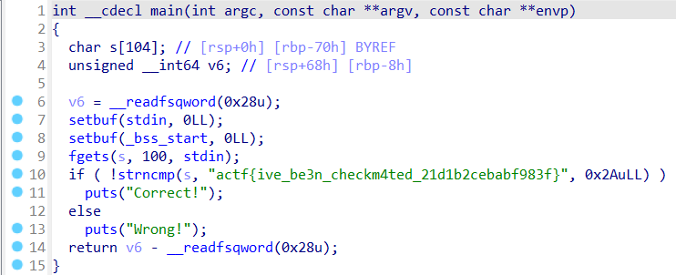

# checkers
`IDA Pro` `Decompile`
<br>
<br>

This challenge is straight forward, we can either run it and using `ltrace` to find the flag, or using a decompiler such as `ghidra` or `IDA Pro` to view the source code, I prefer to decompile it and here is the decompilation result.

<p align=center>
    
</p>

And the flag is 
```
actf{ive_be3n_checkm4ted_21d1b2cebabf983f}
```