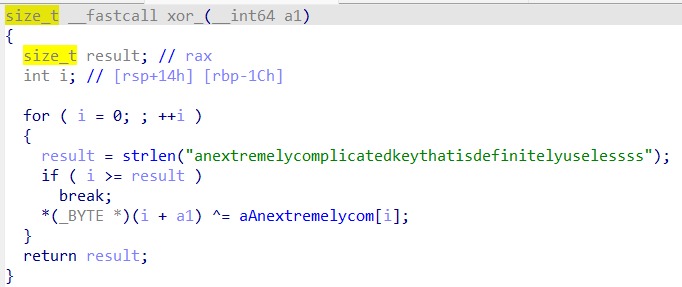

# zaza
`Python Scripting` `IDA`
<br>
<br>

In this challenge, first we need to see how the program works by decompiling it using IDA, after you put the binary the main would look like this.

<p align=center>
    
</p>

As you can see we need to answer some question before we can reach the `win()` function, the first answer was obvious, it's `4919`. The second answer we can just put `1` as it'll be calculate with our previous answer, as long the answer is not 1, we can proceed. The last one we need to give the program a string with the length of `51`, but look carefully, before it was compared with the random special char, it first processed by `xor()` function. Below is the `xor()` funciton.

<p align=center>
    
</p>

We can see that there it xor our input `ai` plus the value of `index` with the string `anextremlycomplicatedkeythatisdefinitelyuselessss` starting from by `index`. So now how these 2 thing connected? The expected result in the `main()` is some random special character, which mean we can use this as the expected result, therefore if we want to find the correct input, We can simply just `Expected Input = A^B`, so let's create the Python.

**Xor.py**
```python
import string

a = "2& =$!-( <*+*( ?!&$$6,. )' $19 , #9=!1 <*=6 <6;66#"
b = "anextremelycomplicatedkeythatisdefinitelyuselessss"
print(len(a))
print(len(b))

result = [(ord(x)^ord(y)) for x,y in zip(a,b)]
flag = ""
for r in result:
    flag += chr(r)

print(flag)
```

Once we run it, it print this string.

```
SHEEPSHEEPSHEEPSHEEPSHEEPSHEEPSHEEPSHEEPSHEEPSHEEP
```

I guess that's the final answer we need, so now we can just connect to the nc and answer everything.

```
nc challs.actf.co 32760

I'm going to sleep. Count me some sheep: 4919
Nice, now reset it. Bet you can't: 1
Okay, what's the magic word?
SHEEPSHEEPSHEEPSHEEPSHEEPSHEEPSHEEPSHEEPSHEEPSHEEP
actf{g00dnight_c7822fb3af92b949}
```

There we go, we got the flag.
