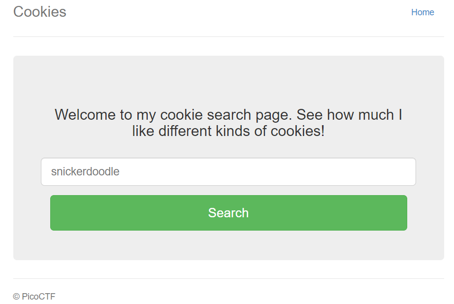
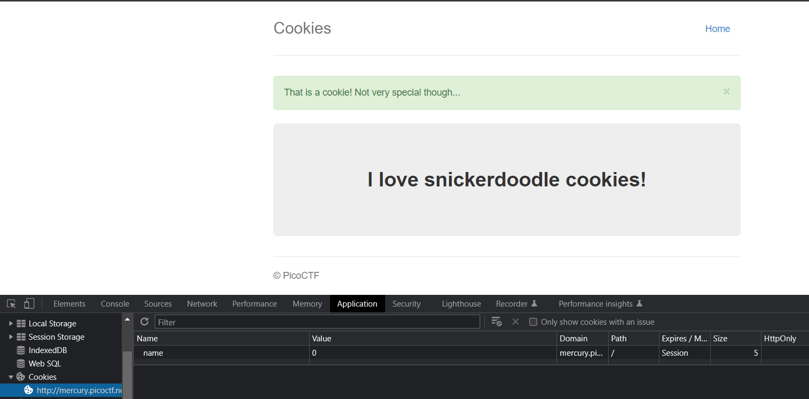
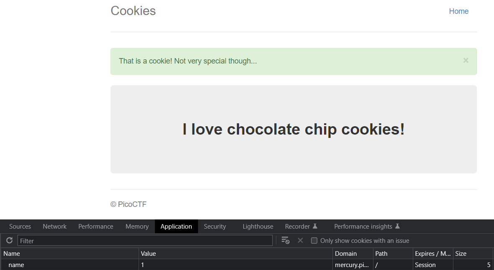
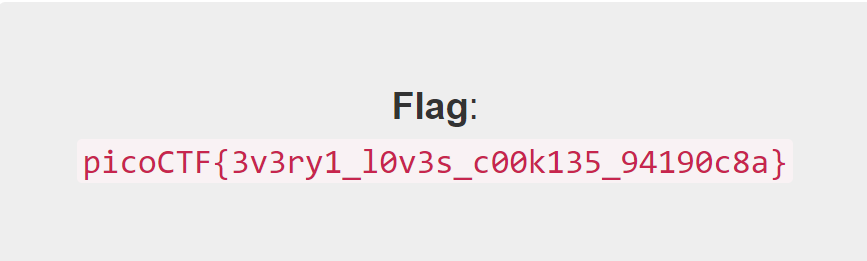

# Cookies
## Overview
Points: 40  
Category: Web Exploitation

## Description
Who doesn't love cookies? Try to figure out the best one. http://mercury.picoctf.net:21485/

## Hints

None

## Solution

Upon opening the website we are greeted with a simple box that we can input string to it, and it expected us to input a cookie name. It has a `snickerdoodle` as placeholder, so we're going tos tart from that and submit it.

<p align=center>
    
</p>

After we search `snickerdoodle` on the website, it redirect us to another website.

<p align=center>
    
</p>

After inputing the string, we can then open DevTool by pressing `F12` or you can use `CTRL + SHIFT + I`; then go to the `Application` section and find the cookies.

This time we can see the cookie value is `0` and you can see there is a sentece above the box that said `That is a cookie! Not very special though...`. We can assume that we can change the value of the cookie and it'll output a different result per-cookies, now let's change the value to 1 and see what's changed.

<p align=center>
    
</p>

So it's actually changed! Now we just need to change the value until it gives us the flag.

<p align=center>
    
</p>

I found mine at `18`, you may find it different from mine.

## Flag

```picoCTF{3v3ry1_l0v3s_c00k135_94190c8a}```

