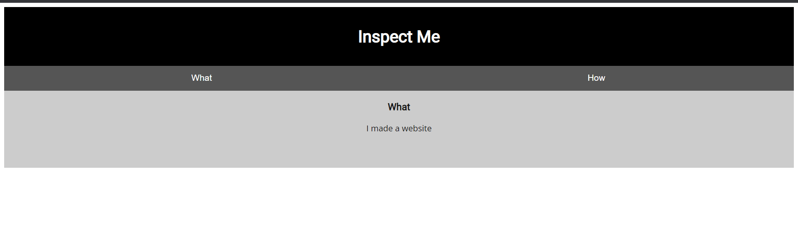

# Insp3ct0r
## Overview
Points: 50  
Category: Web Exploitation

## Description
Kishor Balan tipped us off that the following code may need inspection: https://jupiter.challenges.picoctf.org/problem/41511/ or http://jupiter.challenges.picoctf.org:41511

## Hints

1. How do you inspect web code on a browser?
2. There's 3 parts

## Solution

This is a static website and the flags are spread across the website source code, to begin with when can see the full source code of this static website using `CTRL + U`, what it'll do, it's going to open a new tab that contain the source code of the page where you used the command on.

<p align=center>
    
</p>

Now we just need to view the source code and a new tab will open for us.

```html
<!doctype html>
<html>
  <head>
    <title>My First Website :)</title>
    <link href="https://fonts.googleapis.com/css?family=Open+Sans|Roboto" rel="stylesheet">
    <link rel="stylesheet" type="text/css" href="mycss.css">
    <script type="application/javascript" src="myjs.js"></script>
  </head>

  <body>
    <div class="container">
      <header>
	<h1>Inspect Me</h1>
      </header>

      <button class="tablink" onclick="openTab('tabintro', this, '#222')" id="defaultOpen">What</button>
      <button class="tablink" onclick="openTab('tababout', this, '#222')">How</button>
      
      <div id="tabintro" class="tabcontent">
	<h3>What</h3>
	<p>I made a website</p>
      </div>

      <div id="tababout" class="tabcontent">
	<h3>How</h3>
	<p>I used these to make this site: <br/>
	  HTML <br/>
	  CSS <br/>
	  JS (JavaScript)
	</p>
	<!-- Html is neat. Anyways have 1/3 of the flag: picoCTF{tru3_d3 -->
      </div>
      
    </div>
    
  </body>
</html>
```

with that we got our first part of the flag `picoCTF{tru3_d3`. For the next flag we might need to explore the `href` and `src`, I explored the `"https://fonts.googleapis.com/css?family=Open+Sans|Roboto"` but got nothing in it, so I decide to go the next href, which is `mycss.css` and look what I found:

```css
/* You need CSS to make pretty pages. Here's part 2/3 of the flag: t3ct1ve_0r_ju5t */
```
On the bottom of the CSS file I found the 2nd part of the flag `t3ct1ve_0r_ju5t`. With this we only need to find the last part which I assume will be on the `myjs.js` file, and

```javascript
/* Javascript sure is neat. Anyways part 3/3 of the flag: _lucky?832b0699} */
```

We found the last piece, horray!

Combine all the pieces and we got the full flag.


## Flag

```
picoCTF{tru3_d3t3ct1ve_0r_ju5t_lucky?832b0699}
```                                             