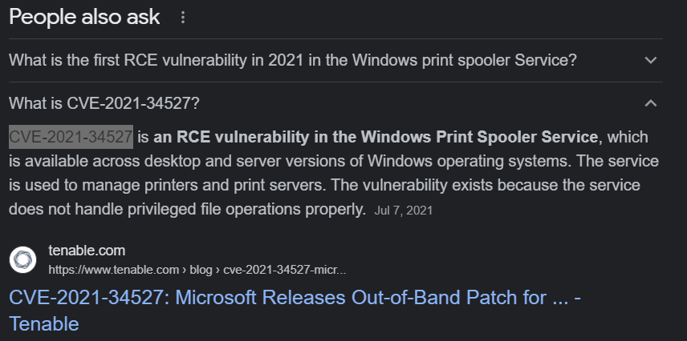

# CVE-XXXX-XXXX
## Overview
Points: 200  
Category: Binary Exploitation

## Description
Enter the CVE of the vulnerability as the flag with the correct flag format:  

`picoCTF{CVE-XXXX-XXXXX}`  

replacing XXXX-XXXXX with the numbers for the matching vulnerability.  

The CVE we're looking for is the first recorded remote code execution (RCE) vulnerability in 2021 in the Windows Print Spooler Service, which is available across desktop and server versions of Windows operating systems. The service is used to manage printers and print servers.

## Hints

1. We're not looking for the Local Spooler vulnerability in 2021...

## Solution

1. We can just simply search 'The First CVE for RCE in Windows Print Spooler Service in 2021' and get the CVE codes.

  

## Flag

**picoCTF{CVE-2021-34527}**